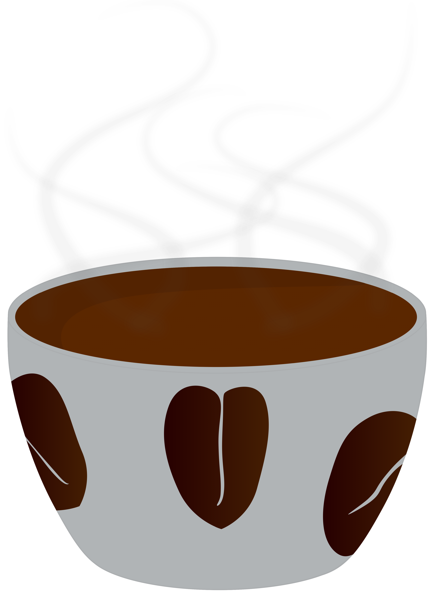

# ☕ Cafetería "Oslo" — Proyecto Web

<p align="center">
  
</p>

Este es un proyecto ficticio de una **página web para una cafetería**, creado con **HTML, CSS y JavaScript**.  
La idea es practicar diseño web, estructura semántica y organización de componentes.

---

## ✨ Características

- Página de inicio con navegación simple.
- Secciones para **Eventos, Productos y Reservas**.
- Colección de productos destacados (panes, dulces, brunch, etc.).
- **Diseño responsive** adaptable a móviles y pantallas grandes.
- Tipografías de **Google Fonts** (Montserrat, Outfit, Red Hat Display).

---

## 📂 Estructura del Proyecto

```bash
📁 Cafeteria-Oslo
├── index.html          # Página principal
├── products.html       # (enlace futuro para productos)
├── events.html         # (enlace futuro para eventos)
├── ProyectDK.css       # Estilos principales
├── DKproyectDK.js      # Script para interactividad
└── images/             # Carpeta con imágenes y recursos
```
